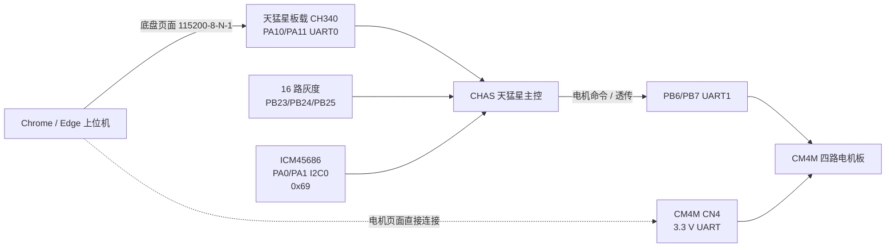

# MSPM0G3507 多产品上位机 Agent 开发手册

本文供**完全没有项目历史上下文**的 Agent 使用。目标是让 Agent 能在不混淆板卡、
不破坏旧固件兼容性、不削弱安全停机和升级恢复能力的前提下，为 CM4M、CHAS 或后续
新产品开发固件版本、协议功能和网页工作台。

本文是开发流程和跨模块契约，不取代原理图、协议正文、内存布局或实机验证记录。
出现冲突时，按第 3 节的事实来源优先级重新核验，不能以本文覆盖较新的硬件事实。

## 1. 开工前的强制检查

先确认任务属于哪个产品，再读文件。禁止先复制现有页面或固件再猜差异。

| 产品 | 实体板卡 | 应用身份/板型 ID | 上位机入口 |
| --- | --- | --- | --- |
| `CM4M` | 自研 MSPM0G3507SPTR 四路 DRV8701 闭环电机板 | 升级板型 ID `0x4D344D43` | `motor.html` |
| `CHAS` | 天猛星 MSPM0G3507 双轮灰度循迹底盘主控 | PING 产品 ID、升级板型 ID 均为 `0x53414843` | `chassis.html` |

开始任何任务前执行：

```powershell
Set-Location H:\race\ti_cup\2026_my_ti
Get-Content -Raw .\AGENTS.md
git status --short
```

然后按产品阅读：

- CM4M：`motor_firmware/README.md`、`docs/schematic-facts.md`、
  `docs/memory-map.md`、`docs/protocol.md`。
- CHAS：`gray_line_chassis/README.md`、`docs/wiring.md`、
  `docs/control-and-tuning.md`、`docs/validation.md`。
- 公共网页：本仓库 `README.md`、本文，以及本次要修改的 HTML、CSS、MJS。
- MSPM0G 驱动：使用 `mspm0g-contest` 技能定位资料，但实际 DriverLib API 仍要在本机
  SDK 头文件中用 `rg` 复核。

工作树可能包含用户尚未提交的资产。不得 `reset`、`checkout`、清理或覆盖无关内容。
手工编辑使用 `apply_patch`。

## 2. 不能越过的边界

1. CM4M 和 CHAS 是两块不同 PCB、两个独立产品。不能混用固件、板型 ID、状态记录、
   参数记录或升级镜像。
2. 上电、复位、断链、通信超时、升级入口、无效参数和异常恢复都必须先停机。
   网页连接成功、读取参数或恢复轮询均不得自动恢复旧运动目标。
3. 网页只能在用户明确点击连接后调用 Web Serial 端口选择/打开流程，页面加载时不得
   自动打开已授权串口。
4. 急停必须高于运行开关、目标值、自动整定和透传。清除急停只解除锁存，不等于使能电机。
5. 公开 Pages 仓库不得加入首次烧录镜像、NONMAIN、SWD/XDS110 恢复材料、私有升级包、
   兼容字段的实际字节或真实板卡敏感日志。
6. 主机测试和离线构建不能写成“实机通过”。没有真实写入和回读，不能声称 UART 升级成功；
   没有相同工况前后遥测，不能声称控制效果提升。
7. 任何真实电机、串口写入、复位或烧录操作，都必须取得当前用户对目标板、通道、速度、
   时长和急停方式的明确授权，并遵守根 `AGENTS.md` 的硬件安全要求。

## 3. 权威事实来源

发生冲突时按以下顺序处理：

1. 当前板卡原理图、实测记录、目标模块硬件事实文档。
2. 当前源码、链接脚本、构建脚本和生成 map。
3. 本机 MSPM0 SDK 2.10.00.04 官方头文件与官方示例。
4. 模块 README 和设计文档。
5. 技能、历史示例和旧发布说明。

协议与升级的主要权威源：

| 契约 | 板端/工具权威源 | 网页消费者 |
| --- | --- | --- |
| CM4M 应用协议 | `motor_firmware/docs/protocol.md`、`firmware/application/src/protocol.c` | `protocol.mjs`、`app.mjs` |
| CM4M Python 协议 | `motor_firmware/tools/motor_protocol.py` | 测试和命令行工具 |
| CHAS 主机协议 | `gray_line_chassis/include/chassis_host_protocol.h`、`src/chassis_host_protocol.c` | `chassis_protocol.mjs`、`chassis_app.mjs` |
| CHAS 到 CM4M | `gray_line_chassis/include/motor_protocol.h`、`src/motor_protocol.c` | `chassis_bridge.mjs`、CM4M 页面 |
| CM4M 升级 | `motor_firmware/docs/memory-map.md`、镜像打包脚本 | `firmware_update.mjs` |
| CHAS 升级 | CHAS 内存布局、镜像打包脚本 | `chassis_firmware_update.mjs` |
| 跨页面串口交接 | 浏览器行为和安全状态 | `serial_handoff.mjs`、两个 `*_app.mjs` |

`motor_firmware/web/` 还有受自动测试覆盖的网页实现。修改 Pages 中同名协议、参数、升级
或整定模块前，必须先比较两份实现，明确哪份是本次源、哪份要同步。不能让公开页面和固件
仓库静默分叉。

## 4. 硬件与数据流



关键边界：

- CHAS 主机链路：板载 CH340，PA10/PA11 UART0。
- CHAS 到 CM4M：PB6/PB7 UART1；默认 A(0) 为左轮、C(2) 为右轮，参数 v2 可选择任意
  两个不同的 A/B/C/D 通道。改映射后必须重新架空验向。
- CM4M CN4：115200-8-N-1、3.3 V 逻辑；板端 RX 是 PA11/UART0_RX，板端 TX 是
  PB6/UART1_TX。固件把两个 UART 实例组成一条逻辑全双工链路。
- 两板独立供电时只共地，不并联 3.3 V；3.3 V UART 不是 5 V TTL 或 RS-232。

## 5. 网页仓库结构

本仓库没有前端构建步骤，GitHub Pages 直接加载 HTML、CSS 和 ES modules。

| 文件 | 职责 |
| --- | --- |
| `index.html`、`product-selector.css` | 产品选择首页，只选择产品，不持有设备状态 |
| `motor.html`、`app.mjs` | CM4M 工作台和业务状态机 |
| `protocol.mjs` | 公共帧、CRC、CM4M 命令/状态/参数编解码 |
| `motor_command.mjs` | CM4M 命令输入校验 |
| `motor_autotune.mjs` | 单通道电机 PI 自动整定流程 |
| `parameter_format.mjs` | Q16.16 等参数显示/回写精度 |
| `firmware_update.mjs` | CM4M 镜像拒绝规则和 TI 二级 BSL 客户端 |
| `chassis.html`、`chassis_app.mjs` | CHAS 工作台、轮询、手动控制和功能页面 |
| `chassis_protocol.mjs` | CHAS 身份、能力、命令、遥测和参数编解码 |
| `chassis_wheel_limits.mjs` | 左右轮通道映射与电机 Flash 速度上限校验 |
| `chassis_bridge.mjs` | 经 CHAS 同端口进入/退出 CM4M 透传 |
| `chassis_firmware_update.mjs` | CHAS 镜像拒绝规则和 TI 二级 BSL 客户端 |
| `serial_handoff.mjs` | 多页面 Web Serial 所有权协调 |
| `editorial-ui.css`、`styles.css`、`chassis.css` | 公共视觉语言与产品布局 |
| `vendor/three*.js` | 底盘 IMU 三维姿态显示依赖 |
| `tests/` | Pages 本地 Node 测试，不代表全部跨仓测试 |

不要在 UI 文件里再实现一套 CRC、帧解析或镜像校验。协议细节集中在协议模块；页面负责
连接状态、命令编排和可视化。

## 6. 公共应用帧

两种产品目前使用相同的外层帧，所有多字节值均为小端序：

```text
A5 5A | version:u8 | flags:u8 | sequence:u16 |
command:u8 | reserved:u8 | payload_length:u16 |
payload | crc32:u32
```

| 字段 | 规则 |
| --- | --- |
| `version` | 当前为 1；未知版本必须拒绝 |
| `flags` | bit 0 表示响应；未知语义不能自行解释 |
| `sequence` | 响应回显请求序号；不能只按到达顺序配对 |
| `reserved` | 发送为 0 |
| `payload_length` | CM4M 最大 256；CHAS 板端当前最大 192 |
| `crc32` | 反射多项式 `0xEDB88320`，seed `0xFFFFFFFF`，无 final XOR；覆盖 version 到 payload |

成功响应命令为 `ACK=0x7E`，失败响应为 `NACK=0x7F`。响应 payload 前两字节固定为：

```text
original_command:u8 | error_code:u8 | command_specific_data...
```

解码器必须支持 UART 分片、合包、帧前噪声、错误 CRC 后重新找帧头和 payload 上限拒绝。
不能假设一次 `read()` 等于一帧。固件还应对半帧设置有界的 inter-byte 超时。

### 6.1 当前 CM4M 命令

| 命令 | 值 | 请求 | ACK 数据 |
| --- | ---: | --- | --- |
| `PING` | `0x01` | 无 | `u32 firmware_version` |
| `GET_STATUS` | `0x02` | 无 | 96 字节状态 |
| `SET_ENABLE` | `0x10` | `u8 channel, u8 enable` | 无 |
| `SET_OPEN_LOOP` | `0x11` | `u8 channel, i16 duty_permille` | 无 |
| `SET_SPEED` | `0x12` | `u8 channel, i32 target_mrpm` | 无 |
| `ESTOP` | `0x13` | 无 | 无 |
| `CLEAR_ESTOP` | `0x14` | 无 | 无 |
| `GET_PARAMS` | `0x20` | 无 | 200 字节参数记录 |
| `SET_PARAMS` | `0x21` | 200 字节参数记录 | 无 |
| `SAVE_PARAMS` | `0x22` | 无 | 无 |
| `ENTER_UPDATE` | `0x30` | 无 | 无，随后复位进入二级 BSL |

CM4M 速度单位是减速箱输出轴 `mrpm`，开环单位是千分比。A/B/C/D 对应索引 0/1/2/3。
默认通信超时为 500 ms；只有有效命令刷新超时。超时后四路使能必须清除，后续 PING 或状态
轮询不能恢复运动。

CM4M 当前应用 PING 只有 4 字节版本，没有独立产品 ID。网页识别时必须结合响应长度和完整
解码规则；不能把任意 4 字节 ACK 当成已确认设备。升级阶段仍必须独立核验 CM4M 板型 ID。

### 6.2 当前 CHAS 命令

| 命令 | 值 | 作用 |
| --- | ---: | --- |
| `PING` | `0x01` | 读取 16 字节身份 |
| `GET_TELEMETRY` | `0x02` | 读取旧版 100 字节或差速标定版 148 字节底盘遥测 |
| `SET_RUN` | `0x10` | 设置底盘运行许可 |
| `SET_WHEELS` | `0x11` | 双轮手动目标 |
| `ESTOP` / `CLEAR_ESTOP` | `0x12` / `0x13` | 锁存/解除急停 |
| `ZERO_YAW` | `0x14` | 当前姿态设为航向零点 |
| `CALIBRATE_GYRO` | `0x15` | 陀螺仪静止偏置标定 |
| `START_ANGLE_AUTOTUNE` | `0x16` | 带安全确认的角度环整定 |
| `ABORT_CALIBRATION` | `0x17` | 中止标定并安全停机 |
| `GET_PARAMS` / `SET_PARAMS` / `SAVE_PARAMS` | `0x20` / `0x21` / `0x22` | 参数读、RAM 应用、Flash 保存 |
| `GET_MOTOR_LIMITS` | `0x23` | 读取从 CM4M Flash 同步的四通道速度上限 |
| `GET_IMU_TELEMETRY` | `0x24` | 读取 96 字节 ICM45686 六轴融合遥测 |
| `ENTER_UPDATE` | `0x30` | 进入 CHAS 二级 BSL |
| `ENTER_MOTOR_BRIDGE` | `0x31` | 安全停止后进入 CM4M 同端口透传 |

CHAS PING ACK 数据固定为：

```text
firmware_version:u32 | product_id:u32 |
capabilities:u32 | protocol_version:u32
```

必须核对 payload 长度、`product_id` 和 `protocol_version`。串口名、USB VID/PID、用户从首页
选择的产品都不能代替设备身份。

当前 CHAS capability 位：

| bit | 含义 |
| ---: | --- |
| 0 | 16 路灰度 |
| 1 | ICM45686 |
| 2 | 双轮底盘 |
| 3 | 角度环自动整定 |
| 4 | UART 应用升级 |
| 5 | CM4M 电机透传 |
| 6 | CM4M Flash 速度上限同步 |
| 7 | ICM45686 六轴姿态融合与独立遥测 |
| 8 | 三档双向差速辨识与六段角度阶跃标定 |

新增可选功能时优先分配 capability bit。页面必须先检查能力再显示为可操作状态；旧固件缺少
能力时禁用控件并明确提示最低版本，不能点击后才用“参数无效”兜底。

## 7. 状态、遥测和单位

协议字段必须带明确单位、符号、范围和无效状态。UI 只做换算和显示，不能根据波形猜单位。

### CM4M 状态

`GET_STATUS` 当前为 96 字节：16 字节公共头加四个 20 字节通道记录。每通道包含编码器计数、
实际/目标 `mrpm`、输出千分比、使能、模式和编码器错误计数。故障位只能报告 MCU 实际可知的
通信、急停、UART、参数和 TX 状态；当前硬件没有 MCU 可读 DRV8701 nFAULT 或电流采样，
不得虚构驱动故障/电流遥测。

### CHAS 遥测

`GET_TELEMETRY` 的旧记录为 100 字节，包含：

- 运行状态、模式、灰度有效数量和线丢失/IMU 标定/标定繁忙等标志。
- 16 路原始/有效灰度位图、线位置（协议为千分之一毫米）。
- Z 轴角速度、航向、航向参考、角度误差（协议为千分之一度或度每秒）。
- 转向量、左右轮线速度（协议为千分之一毫米每秒）。
- 左右轮目标 `mrpm`、IMU bias、各模块失败计数和最后有效命令时间。
- 角度标定状态、进度、结果、候选 PID、峰值角速度和响应时间。

能力位 8 宣告 148 字节扩展记录；前 100 字节保持上述布局不变，尾部增加等效轮距、
正反方向增益、双向差异、当前阶跃目标、最坏超调/稳定时间、左右实际轮速/输出、CM4M
故障位、12 段进度和电机状态有效位。网页必须同时接受精确的 100/148 两种长度，其他长度
一律拒绝；缺少能力位 8 的固件不得启用新版角度标定入口。

固定长度记录不能在末尾直接追加字段并仍叫同一格式。扩展时必须选择一种明确策略：

1. 新命令返回新版本记录；或
2. PING capability 宣告新格式，解码器按精确长度分别解析旧/新版本；或
3. 新增带 `record_version` 和 `record_size` 的可扩展记录。

无论采用哪种方式，旧固件的原长度必须继续有测试覆盖。页面对未知长度应报“固件/页面不兼容”，
不能错位读取后画出看似合理的假波形。波形断线、超时或页面后台降频时要标记数据陈旧，不用
上一帧冒充实时值。

## 8. 参数记录和 Flash 迁移

### CM4M

当前参数记录 magic 为 `0x4D50524D`、version 1、size 200。记录含 sequence、通信超时、
低速窗口、四路 40 字节参数、保留字和 CRC。增益/滤波/减速比包含 Q16.16 值。

- `SET_PARAMS` 校验完整记录和 CRC，只应用 RAM 副本。
- `SAVE_PARAMS` 必须停止四路，写双扇区记录、回读/CRC 校验，结束后保持禁用。
- 网页 Q16.16 至少保留 6 位小数，确保原始整数 1 显示并回写后仍为 1。

### CHAS

当前参数 magic 为 `0x50534843`、size 64；网页可读取 version 1、2 和 3，当前写出
version 3。v2 在保留区加入左右轮通道，v3 在 offset 54 加入
`gray_active_high`/`grayActiveHigh`。v1 默认 A/C；v1/v2 缺失灰度极性字段时迁移为 1，
保持旧固件的高电平黑线行为。新 v3 出厂默认为 0（低电平黑线）。
左右轮必须是 0..3 内两个不同通道，灰度极性只允许 0 或 1。

| offset | size | 类型 | 含义 | v3 默认/范围 | 旧版迁移 |
| --- | --- | --- | --- | --- | --- |
| 0 | 4 | `u32` | magic `CHSP` | `0x50534843` | 不变 |
| 4 | 2 | `u16` | 参数版本 | 3 | 接受 1/2 |
| 6 | 2 | `u16` | 记录长度 | 64 | 不变 |
| 8 | 4 | `u32` | 保留 | 0 | 保留 |
| 12..51 | 40 | `float[9] + u32` | 速度、两级 PID、通信超时 | 各字段现有范围 | 保留原值 |
| 52 | 1 | `u8` | 左轮通道 | 0..3，默认 A/0 | v1 补 0 |
| 53 | 1 | `u8` | 右轮通道 | 0..3，默认 C/2 | v1 补 2 |
| 54 | 1 | `u8` | 灰度黑线高电平有效 | 0/1，默认 0 | v1/v2 补 1 |
| 55..59 | 5 | bytes | 保留 | 0 | 保留 |
| 60 | 4 | `u32` | CRC32 | 覆盖 0..59 | 不变 |

### 修改参数格式的规则

1. 先写字节级布局表：offset、size、类型、单位、范围、默认值、旧版本迁移值。
2. 参数 `version` 递增；只有布局完全兼容时才允许复用 size，通常应同时更新 size。
3. 板端读取旧版本后在 RAM 中显式迁移，不能因新字段缺失直接恢复全厂默认。
4. 网页解码器至少能读取当前已发布版本；写回时保留未知/保留字段，或明确执行受控升级。
5. CRC 覆盖范围必须在板端 C、Python、Pages 和测试中一致。
6. 参数校验失败时固件采用安全默认、置诊断状态并保持停机。
7. `SET_PARAMS` 和 `SAVE_PARAMS` 分开；Flash 失败返回明确错误，不能假装保存成功。

底盘手动轮速的输入范围必须来自 `GET_MOTOR_LIMITS` 返回的 CM4M Flash 参数，并结合当前
左右轮通道映射逐轮校验。没有同步成功时，页面应显示“电机上限未同步”，禁用超出保守范围的
发送，不能硬编码 150 rpm、200 rpm 或任意统一上限。

## 9. 新增功能的标准流程

### 9.1 只新增 UI/可视化

1. 明确数据已经存在于哪个命令、字段和单位中。
2. 在产品自己的页面和 `*_app.mjs` 中实现，不把 CHAS 状态放进 CM4M session，反之亦然。
3. 处理未连接、连接中、数据陈旧、设备不支持、急停、升级/整定占用和协议错误状态。
4. 不生成演示遥测，不用随机数填图，不在无设备时显示“正常”。
5. 不改变控制命令顺序；图表渲染不得阻塞串口读循环或安全命令。
6. 添加纯函数测试，并用真实浏览器检查桌面/移动视口和控制台错误。

### 9.2 新增协议命令

先写一页短设计，至少包括：命令号、方向、请求/ACK 字节布局、单位、范围、状态前置条件、
超时、幂等性、错误码、旧固件表现和 capability/version 策略。

实现顺序：

1. 在目标固件协议头和协议文档分配命令号，确认未与另一语义冲突。
2. 板端解析严格检查版本、长度、保留位、范围和当前状态；失败返回 NACK。
3. 运动相关命令只有校验全部完成后才能改变目标或使能。
4. 网页协议模块加入编码/解码纯函数，业务编排放在 `app.mjs` 或 `chassis_app.mjs`。
5. 同步所有消费者，不复制未经测试的魔数。
6. 添加 C、Python、Node 的同一 golden frame，以及错误 CRC、错误长度、错误序号和旧固件用例。
7. 更新文档、能力位、固件版本和发布说明。

协议消费者同步检查清单：

```text
motor_firmware/firmware/application/src/protocol.c
motor_firmware/tools/motor_protocol.py
motor_firmware/web/protocol.mjs
m4-motor-console-pages/protocol.mjs
gray_line_chassis/src/motor_protocol.c
gray_line_chassis/include/chassis_host_protocol.h
gray_line_chassis/src/chassis_host_protocol.c
m4-motor-console-pages/chassis_protocol.mjs
m4-motor-console-pages/app.mjs
m4-motor-console-pages/chassis_app.mjs
两套 firmware_update 模块及全部相关测试
```

不是每次都要修改全部文件，但必须逐项说明“不受影响”的理由。

### 9.3 新增遥测字段

1. 确定采样点、更新周期、原始精度和溢出行为。
2. 选择第 7 节的兼容扩展策略，不静默改变固定长度。
3. 固件生成遥测快照时避免在 ISR 做格式化或复杂浮点处理。
4. 页面先完成精确长度/版本校验再读取字段。
5. 图表保存有界数量的点；断链清空实时状态或明确标记陈旧。
6. 测试最小值、最大值、负值、NaN/Inf 禁止策略、计数器回绕和丢帧。

### 9.4 新增自动标定/整定

自动标定必须是有界状态机，至少具备：

- 明确的安全确认 token 或等价的双重前置条件。
- 开始前停止其他通道、备份 RAM 参数并检查传感器/反馈有效。
- 最大输出、最大速度、单阶段时长和总时长硬限制。
- 用户中止、通信超时、传感器失败、反馈符号错误和异常值路径。
- 任一失败立即目标清零、禁用输出、恢复 RAM 参数且不写 Flash。
- 只有候选参数和独立闭环验收都通过后才允许保存。
- 输出可下载的真实报告；报告区分原参数、临时候选、最终保存值和采样条件。

网页在整定期间持有串口排他锁，拒绝跨页面 handoff。整定算法变化只有在同工况前后遥测可比
时才能写“性能提升”。

## 10. 产品识别、版本和新产品接入

固件版本使用单调递增 `u32`，当前页面显示约定为：高 16 位 major，随后 8 位 minor，低 8 位
patch，例如 `0x00010004` 显示为 1.0.4。发布版本不能只改文件名；源码、打包头、PING、README、
验证记录和交付文件必须一致。

接入第三种产品时，不要把它伪装为 CM4M 或 CHAS 的“模式”。至少完成：

1. 分配唯一应用 `product_id` 和唯一升级 `board_id`，记录分配依据并加冲突测试。
2. 定义 PING 身份结构和 capability 位。新产品不应延续 CM4M 仅返回版本的历史限制。
3. 明确物理 UART、电平、波特率、超时、板端安全停机和恢复路径。
4. 独立定义命令、状态、参数和错误码；只复用经过验证的外层帧/CRC/BSL 传输。
5. 新建产品 HTML、协议模块、业务 app 模块和升级镜像校验器。
6. 在 `index.html` 添加产品入口；选择页不提前获取串口权限。
7. 接入 `serial_handoff.mjs`，定义升级/整定/危险操作时的拒绝规则。
8. 增加“本产品拒绝其他产品身份和镜像”的双向测试。
9. 更新根仓产品地图、公共 README 和本手册。

板型 ID 不是 UI 标签。即使两个产品恰好使用相同 Flash 布局，也必须分别验证 board ID；
不能为了复用一个更新器放宽判断。

## 11. Web Serial 所有权和同端口透传

### 跨页面交接

`serial_handoff.mjs` 使用：

```text
BroadcastChannel("m4-console-serial-handoff-v1")
```

连接流程应为：用户点击连接 -> 请求另一页安全释放 -> 等待结果/延迟 -> 调用端口选择器 ->
打开端口 -> PING 识别。对方处于升级、自动整定或无法安全停机时必须拒绝释放，当前页不能强抢。

页面卸载不是可靠的安全机制。固件通信超时仍是最终停机保障；网页主动断开前也应尽力发送零目标
和禁用/急停，再关闭 reader、writer 和 port。

### CHAS 到 CM4M 透传

CHAS v1.0.4 及以上支持同一 CH340 端口访问后级 CM4M。进入透传前必须：

1. PING 确认是 CHAS 且 capability bit 5 存在。
2. 停止底盘控制，左右轮目标清零。
3. 令后级 CM4M 四路清零/禁用。
4. 发 `ENTER_MOTOR_BRIDGE`，再使用 CM4M PING 验证透传目标。

透传空闲约 5 秒后固件回到 CHAS 模式。网页退出透传后要等待该时间窗结束，再用 CHAS 的
16 字节 PING 身份确认，不要关闭后立刻重复打开同一 Web Serial 端口。

CM4M PING ACK 数据为 4 字节，CHAS 为 16 字节。未知长度、CRC 错误或身份不符必须拒绝；
不能以“能收到 ACK”判断透传已建立。透传固件升级仍要按 CM4M board ID 校验镜像。

## 12. UART 应用升级

CM4M 和 CHAS 当前共享应用分区形状，但不是共享固件：

```text
0x3000-0x30FF   0x100 字节提交头，最后写入
0x3100-0x1F7FF  应用向量和代码
0x1F800 起       参数存储区，不得擦写
```

网页本地镜像校验必须覆盖：

- magic、头版本、头长度和仅允许的 flags。
- 单调递增且不低于 Boot Manager 下限的固件版本。
- 精确 board ID：CM4M `0x4D344D43`，CHAS `0x53414843`。
- vector address 必须为 `0x3100`。
- 镜像长度非零、8 字节对齐、文件长度与头一致，且不覆盖参数区。
- 初始 SP 位于目标 SRAM、8 字节对齐。
- reset vector 为 Thumb 地址且落在应用内；非零中断向量同样受限。
- header CRC 和 application image CRC。
- TI BSL 独立 CRC 校验所需的最小长度。

升级事务顺序不能改变：

```text
页面本地校验镜像
-> 锁定控制 UI
-> 急停并确认安全状态
-> 进入目标产品二级 BSL
-> 校验 BSL 身份/配置
-> 只擦除应用区
-> 从 0x3100 开始写代码
-> 最后写 0x3000 提交头
-> 目标端 CRC 校验
-> 启动应用
-> 重新 PING 并核对产品和版本
```

这是受保护 Boot Manager + 二级 BSL + 单应用布局，不是 A/B 回滚。中途断电时，未提交或 CRC
失败的应用不得启动，重新上电后应进入 BSL 恢复。不得扩大擦写白名单、启用 mass erase、
Factory Reset 或任意内存回读。

`firmware_update.mjs` 和 `chassis_firmware_update.mjs` 当前存在相似实现。修改公共 BSL 行为时
必须比较并同步两者，但产品 board ID 和错误文案仍要独立。公开文档只描述兼容机制，不抄出
上位机内部的固定兼容字节。

## 13. UI 和交互规范

两个控制台应使用统一的信息层级、颜色语义、控件尺寸和状态文案，同时保持产品功能独立。

- 第一屏优先显示产品身份、连接状态、急停和核心实时状态，不做营销式 hero。
- 运行、急停、升级、保存参数等状态必须清楚区分；危险操作不能仅靠颜色表达。
- 图标按钮使用已有图标库/符号并提供 tooltip；数值输入必须显示单位和合法范围。
- 二进制配置使用开关/复选框，模式使用分段控制，视图使用 tabs，波形用可缩放但有界的图表。
- 控件禁用时说明原因，例如“未连接”“固件不支持”“电机 Flash 上限未同步”“急停锁存”。
- 不在按钮、卡片或紧凑面板使用超大标题；不嵌套卡片，不让文本在 390 px 宽度溢出。
- 所有运动目标在发送前做页面校验，固件仍须重复校验。页面校验不能代替板端安全限制。
- 参数读取失败时不能用表单默认值覆盖设备；必须保持只读/未知状态，等待重新读取。
- 无设备时不展示假遥测。开发截图若使用模拟 transport，必须在页面和交付说明中显式标为测试。
- Three.js IMU 模型只是姿态可视化，原始加速度、角速度、姿态角和标定状态仍要以数值/波形呈现。

## 14. 测试矩阵

测试范围随改动扩展。协议、参数、升级或产品身份改动至少覆盖三层：纯编解码、固件主机测试、
完整离线构建；UI 再加真实浏览器检查。

### CM4M

从 `motor_firmware/` 执行：

```powershell
powershell -ExecutionPolicy Bypass -File .\tools\build.ps1
powershell -ExecutionPolicy Bypass -File .\tests\run_tests.ps1
```

构建后检查三套 map、分区无重叠、应用镜像头、Flash/RAM 使用、文件大小和 CRC。网页共享模块
的 Node 测试由 `run_tests.ps1` 发现，不能因 Pages 自测通过而跳过。

### CHAS

从 `gray_line_chassis/` 执行：

```powershell
powershell -ExecutionPolicy Bypass -File .\tests\run_tests.ps1
powershell -ExecutionPolicy Bypass -File .\tools\build_release.ps1 -ReleaseImage
```

只有端口/诊断目标相关变更才按 README 补充 `safe/gray/imu/motor_link` 构建。`motor_spin`、
`motor_hold`、烧录和串口验收仍需用户当次授权。

### 公共 Pages

从 `m4-motor-console-pages/` 执行：

```powershell
node .\tests\test_chassis_motor_limits.mjs
python .\serve_web.py --port 8765
```

还要复用 `motor_firmware/tests` 中相关协议、升级、参数和整定 Node 测试。新增模块必须新增可直接
运行的测试入口，不能只靠浏览器手点。

真实 Chrome/Edge 至少检查 1280x720 和 390x844：

- 首页产品选择以及 CM4M/CHAS 状态不串页。
- 页面加载不弹串口授权；只有点击连接才弹。
- 错产品、错 PING 长度、错镜像、旧 capability 都被明确拒绝。
- 连接、断开、急停、解除急停、轮询停止和串口 handoff 状态正确。
- 所有 tab、表单边界、长中文文案、图表和 Three.js 不横向溢出或遮挡。
- 控制台无异常，模块/图片请求无 404；无设备时没有虚拟遥测。

### Golden frame 最低集合

每个新命令至少测试：

- 一个正常请求字节串和正常 ACK 字节串。
- payload 最小/最大合法值。
- payload 少 1 字节、多 1 字节。
- 错协议版本、错 CRC、错序号、未知命令和设备返回 NACK。
- 分两次、逐字节、两帧合并输入解码器。
- 旧固件无 capability/返回旧记录时页面的兼容或明确拒绝。
- 另一产品身份和升级镜像的交叉拒绝。

## 15. 发布流程

1. 确认产品、目标版本和兼容策略已写入任务说明。
2. 完成板端、工具、Pages 和文档的消费者同步检查。
3. 运行对应主机测试和离线构建，记录原始命令与结果。
4. 由构建/打包脚本生成镜像，不手改 `build/`、`artifacts/` 或 BIN。
5. 核对 PING 版本、镜像头版本、board ID、vector、大小、CRC/SHA256 和 README 一致。
6. 若未取得授权，到此停止并明确标记“未烧录、未实机验证”。
7. 实机升级获授权后，记录端口、板卡、起止版本、镜像校验值、目标 CRC 和重启 PING。
8. 发布 Pages 前确认仓库不含固件/恢复材料/敏感日志，再提交并推送静态站。

网页发布和固件发布是两个动作。推送 Pages 不代表新固件已经托管，也不应把私有升级包提交到
公开站点。

## 16. Definition of Done

只有同时满足以下条件，任务才算完成：

- 产品边界、命令/字段、单位、范围、错误和兼容策略有文档。
- 板端与全部实际消费者同步，未修改项有依据。
- 上电和所有异常路径默认停机；重连不恢复旧运动。
- 新 capability/身份/镜像板型不会被旧页面或其他产品误认。
- 参数旧版本可迁移或明确拒绝，不会静默丢失用户 Flash 配置。
- 主机测试和离线构建通过，生成物来自脚本并给出版本、路径、大小和校验值。
- UI 完成桌面/移动真实浏览器检查，无假遥测和串口自动占用。
- 交付明确区分主机测试、离线构建、只读检查和实机验证。
- 未经授权的烧录、电机动作和恢复操作没有执行。

最终交接至少写明：

1. 改了哪些源文件/文档，影响哪个板卡和接口。
2. 实际运行的命令与结果；未运行项及原因。
3. 每项结果属于主机测试、离线构建、只读检查还是实机验证。
4. 仍需实机确认的接线、方向、参数、负载、恢复和电磁兼容风险。
5. 若生成固件，列出版本、board ID、绝对路径、字节数、CRC32/SHA256。

## 17. 可直接交给零上下文 Agent 的任务模板

```text
你正在 H:\race\ti_cup\2026_my_ti 工作。

任务：<一句话描述要开发的固件/网页功能>
目标产品：<CM4M | CHAS | 新产品名>
目标版本：<例如 0x0001000A；若未确定先核对当前版本再分配>
允许范围：<明确目录和可修改模块>
禁止动作：未经本任务再次授权，不连接/复位/烧录板卡，不发送运动命令。

开工前必须完整阅读：
1. 根 AGENTS.md
2. m4-motor-console-pages/docs/AGENT_DEVELOPMENT_GUIDE.md
3. 目标产品 README 和其中列出的权威硬件/协议/内存文档
4. 本次涉及的板端 C、Python/Node 协议和网页模块

先输出并落实兼容设计：
- 新命令/字段的字节布局、单位、范围、错误码和状态前置条件
- PING capability 或协议/记录版本策略
- 旧固件、旧 Flash 参数和旧页面的行为
- 所有协议消费者及同步方式
- 上电、断链、急停、升级和中止时的停机路径

实施要求：
- 不复制未经测试的魔数，不混用 CM4M/CHAS 身份和镜像
- 连接/读取参数不得自动使能电机
- 固定长度状态/遥测不得静默追加字段
- 参数格式变化必须迁移旧 Flash 或明确拒绝
- 新产品必须有唯一 product ID、board ID、独立页面和交叉拒绝测试
- 使用 apply_patch 编辑，保留用户现有改动

验证要求：
- 运行目标模块 AGENTS.md/开发手册规定的主机测试和离线构建
- 协议增加正常 golden frame、分片/合包、CRC/长度/序号/NACK 和旧版本用例
- UI 用 Chrome/Edge 检查 1280x720、390x844、控制台、404、横向溢出和无设备状态
- 未获得明确授权时只做到离线验证，不得写成实机通过

交付按开发手册第 16 节格式，若生成固件给出版本、board ID、路径、大小和校验值。
```

如果任务描述没有目标产品、兼容策略或硬件授权，Agent 应先通过仓库事实补足可安全推断的部分；
会改变协议或硬件行为的关键歧义无法核验时，必须停下并向用户确认，不能自行把一种产品的约定
套到另一种产品。
